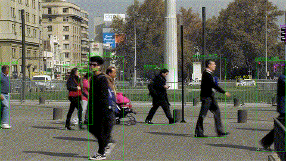

# Hailo AI HAT + Intel RealSense with Raspberry Pi 5 on Ubuntu

This project is based on the original [Hailo AI's Raspberry Pi 5 Examples] (https://github.com/hailo-ai/hailo-rpi5-examples).
The project demonstrates the use of an Intel RealSense camera with a Hailo AI processor on a Raspberry Pi 5 running Ubuntu. Modified pipelines allow access to depth measurements. The project demonstrates the depth measurement of the objects segmented by the Yolov8s model running on Hailo AI Hat+. 
Visit the [Hailo Official Website](https://hailo.ai/) and [Hailo Community Forum](https://community.hailo.ai/) for more information.

## Install Hailo Hardware and Software Setup on Raspberry Pi running Ubuntu

For instructions on how to set up Hailo's hardware and software on the Raspberry Pi 5 running Ubuntu, see the repository [Hailo Raspberry Pi 5 Ubuntu](https://github.com/canonical/pi-ai-kit-ubuntu.git). Also, look at the blog post about the setup process [Hacker’s guide to the Raspberry Pi AI kit on Ubuntu](https://ubuntu.com/blog/hackers-guide-to-the-raspberry-pi-ai-kit-on-ubuntu)


## Installation

### Clone the Repository
```bash
git clone https://github.com/amrzr/hailo-realsense.git
```
Navigate to the repository directory:
```bash
cd hailo-realsense
```

### Installation
Run the following script to automate the installation process:
```bash
./install.sh
```

### Documentation
For additional information and documentation on creating your own custom pipelines, see the [Basic Pipelines Documentation](doc/basic-pipelines.md).

### Running The Examples
When opening a new terminal session, ensure you have sourced the environment setup script:
```bash
source setup_env.sh
```
### Detection and Instance Segmentation with Realsense Camera



#### Run the detection test example (without any depth measurement):
```bash
python hailo_realsense/detection_rs.py --input realsense
```

To close the application, press `Ctrl+C`.

#### Run the segmentation example (with depth measurement):
This script runs the Yolo model to segment objects from the RealSense camera's RGB feed. The average depth (distance) of the segmented objects is displayed on the terminal. This enables finding the distance of non-convex objects, e.g., a donut, a ring, etc., from the camera that is not possible by simply measuring the distance of the centroid of the detected object.

```bash
python hailo_realsense/instance_segmentation_rs.py --input realsense
```

To close the application, press `Ctrl+C`.

## License

This project is licensed under the MIT License. See the [LICENSE](LICENSE) file for details.

## Disclaimer

This code example is provided by Hailo solely on an “AS IS” basis and “with all faults.” No responsibility or liability is accepted or shall be imposed upon Hailo regarding the accuracy, merchantability, completeness, or suitability of the code example. Hailo shall not have any liability or responsibility for errors or omissions in, or any business decisions made by you in reliance on this code example or any part of it. If an error occurs when running this example, please open a ticket in the "Issues" tab.
